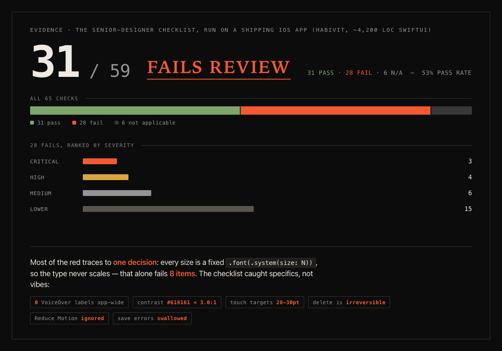

# Senior Product Designer — a Claude Code skill for UI/UX design

An evidence-based senior product designer for any UI/app design or build task — web or native iOS (SwiftUI).

Unconstrained LLMs emit the statistical median of their training data, and that median *is* the "AI slop" aesthetic: indigo gradients, Inter, identical icon-card grids. This skill forces the research, deliberation, and scored verification that a human senior designer does and a median-sampling model skips. Every rule is sourced from **158 vetted design publications** — Apple HIG, WCAG, NN/g research, Bringhurst, Norman, Krug, *Refactoring UI* — not opinion. Output must pass a scored checklist (43 items web / 55 SwiftUI) before it ships.

## Proof it works — a real-world SwiftUI audit

This isn't a vibes skill. Pointed at **Habivit**, a shipping iOS habit tracker (~4,200 LOC SwiftUI), the checklist scored it **31/59 — fails review** and surfaced *specific, severity-ranked* defects, not generic advice:



Concrete findings the checklist caught: **0 VoiceOver labels** app-wide, Dynamic Type frozen by hardcoded `.font(.system(size:))` across 8 view files (one decision failing 8 items), contrast `#616161 ≈ 3.0:1` on small labels, `28–30pt` touch targets, irreversible delete, and ignored Reduce Motion. It also credited what the app gets right (9/10 on anti-slop). Read the full self-audit: [`examples/habivit-ios-audit.html`](examples/habivit-ios-audit.html).

## What this UI/UX design skill does — a research-driven workflow

- **Phase 0 — Platform gate:** web, SwiftUI, or both.
- **Phase 1 — Research before pixels:** problem/user definition, 4–6 named competitors, art direction from outside the algorithmic pool.
- **Phase 2 — Design brief:** every typography/color/spacing/layout/motion decision with two rejected alternatives, ending in a full design-tokens block.
- **Phase 3 — Build:** implement strictly from approved tokens, real content, all states (empty/loading/error).
- **Phase 4 — Scored verification:** score against the checklist, fix every failure, re-score. Only a full score ships.

It also hard-bans the documented AI-generation tells (purple gradients, reflex fonts, glassmorphism, buzzword copy, vanilla component defaults, and more).

## Install the Senior Designer skill for Claude Code

Clone directly into your Claude skills directory:

```bash
git clone https://github.com/sshahzaiib/senior-designer-skill.git \
  ~/.claude/skills/senior-designer
```

Or clone anywhere and copy:

```bash
git clone https://github.com/sshahzaiib/senior-designer-skill.git
cp -R senior-designer-skill ~/.claude/skills/senior-designer
```

Then restart Claude Code (or run `/doctor`) to pick it up.

> The destination folder **must** be named `senior-designer` (it must match the `name:` in `SKILL.md`).

## Usage — auto-triggers on any UI design or build task

The skill auto-triggers whenever you ask Claude to design or build a UI — "build me a landing page," "design the main screen," "this looks AI-generated, fix it," or any color/type/layout decision. No special invocation needed.

## What's inside the skill — files & structure

```
senior-designer/
├── SKILL.md                      # the skill: phases, bans, operating rules
├── evals/evals.json              # eval prompts + assertions
├── examples/                     # real-world proof
│   ├── habivit-ios-audit.png     # the audit chart
│   └── habivit-ios-audit.html    # the full self-audit dossier
└── references/
    ├── checklist.md              # the 43/55-item scored checklist
    └── evidence-base.md          # all 158 sources, per-item scoring, rewrite log
```

## Evidence base & attribution — Apple HIG, WCAG, NN/g, Refactoring UI

Every checklist item is scored against weighted sources (books, standards, peer-reviewed research). The full bibliography, per-item scoring rubric, and the rewrite log of items that initially failed vetting live in [`references/evidence-base.md`](references/evidence-base.md). The design rules and prose are original; the cited works belong to their respective authors and are credited there.

## License

[MIT](LICENSE).
